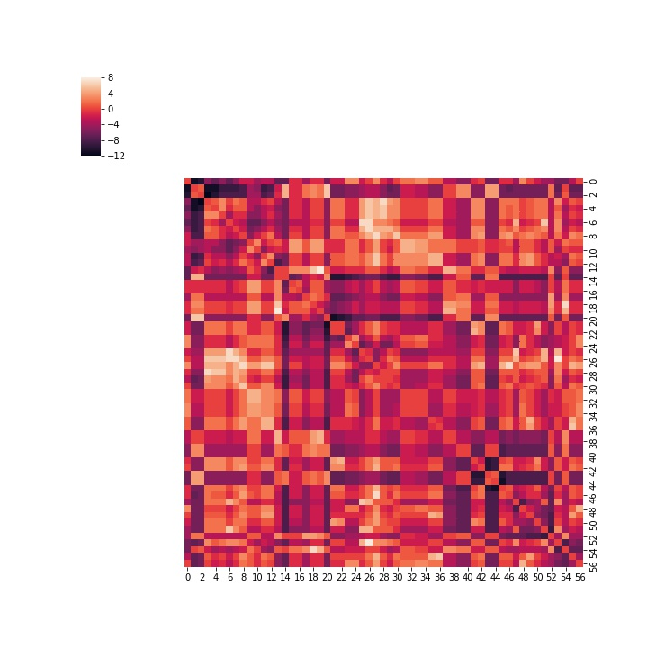

# Binary Tree Reclustering Algorithms for Jets Physics

### **Kyle Cranmer, Sebastian Macaluso and Duccio Pappadopulo**

Note that this is an early development version. 

 

 
 ## Motivation and problem formulation
 
 
 At physics colliders, e.g. the Large Hadron Collider at CERN, two beams of particles (accelerated to very high energies) directed against each other are collided head-on. As a result, new unstable particles get created and a *showering process* happens, where successive binary splittings of these initial unstable particles are produced until all the particles are stable. This process gives rise to jets, which are a collimated spray of energetic charged and neutral particles. We refer to these final particles as the jet constituents.
 
  As a result of this *showering process*, there could be many latent paths that may lead to a specific jet (i.e. the set of constituents). Thus, it is natural to represent a jet and the particular showering path that gave rise to it as a binary tree, where the inner nodes represent each of the unstable particles and the leaves represent the jet constituents.   
 
 In this context, it becomes relevant and interesting to study algorithms to reconstruct the jet constituents (leaves) into a binary tree and how close these algorithms can reconstruct the truth latent path. Being able to perform a precise reconstruction of the truth tree would assist in physcis searches at the Large Hadron Collider. In particular, determining the nature (type) of the initial unstable particle (and its children and grandchildren) that gave rise to a specific jet is essential in searches of new physics as well as precission measurements of the current model, i.e. the Standard Model of Particle Physics.
 
 There are software tools called **Parton Showers** that encode a physics model for the simulation of jets that are produced at colliders.
  A python package for a generative model to aid in machine learning (ML) research for jet physics was provided in [`Toy Generative Model for Jets`](https://github.com/SebastianMacaluso/ToyJetsShower). This model has a tractable likelihood, and is as simple and easy to describe as possible but at the same time captures the essential ingredients of parton shower generators in full physics simulations.
 
 ## Reclustering Algorithms

 This package implements different algorithms to recluster a set of jet constituents (leaves) into a binary tree.
 In particular, we explore how different algorithms can reconstruct the latent structure of the jets generated with the [`Toy Generative Model for Jets`](https://github.com/SebastianMacaluso/ToyJetsShower) package.  Comparisons and visualizations are enabled thanks to the   [`VisualizeBinaryTrees`](https://github.com/SebastianMacaluso/VisualizeBinaryTrees) package, which is also included within this package.
 
 
 There can be many techniques to recluster the set of jet constituents (leaves) into a binary tree, from machine learning based ones to more traditional algorithms. In this package, first we implement the traditional physics based generalized k_t clustering algorithms on the jets generated with the [`Toy Generative Model for Jets`](https://github.com/SebastianMacaluso/ToyJetsShower). These algorithms will be used for comparison and are characterized by
 
 - Permutation invariance with respect to the order in which we cluster the jet constituents. This is an significant difference with respect to traditional Natural Language Processing (NLP) problems where the order of the words within a sentence is relevant.

- Distance measure: the angular separation between two jet constituents is typically used as a distance measure among them. In particular, traditional jet clustering algorithms are based on a measure given by d_{ij} ~  Delta R_{ij}^2, where Delta R_{ij} is the angular separation between two particles.

 
 
 Next, we study and introduce new implementations to jets physics of the following clustering algorithms:
 
 - **Greedy Likelihood**: This algorithms clusters the jet constituents by choosing the node pairing that locally maximizes the likelihood at each level (See the [`notes`](https://github.com/SebastianMacaluso/ToyJetsShower/blob/master/notes/toyshower_v4.pdf) in [`Toy Generative Model for Jets`](https://github.com/SebastianMacaluso/ToyJetsShower) for a description of how the likelihood of a splitting is defined).
 
 - **Beam Search Likelihood** : this is a beam search implementation to maximize the likelihood of the reclustered tree. The beam size is an input parameter. (Note that the Greedy Likelihood is a particular case of the Beam Search Likelihood for beam size of one.) 
 
 
 
 Algorithms are run from the [`treeAlgorithms`](treeAlgorithms.ipynb) notebook. 
 
 Below we compare visualizations of a sample jet generated with  the [`Toy Generative Model for Jets`](https://github.com/SebastianMacaluso/ToyJetsShower) for the truth latent structure and the reclustered one.

 
 
 
 
 ##### Fig. 1: 1D Tree-only visualization of the beam search (with beam size of 50) reclustered tree for a sample jet generated with the [`Toy Generative Model for Jets`](https://github.com/SebastianMacaluso/ToyJetsShower) model. The horizontal ordering of the leaves corresponds to the order in which the leaves are accessed when traversing the tree.
 
 <pre>
 
 </pre>
 
 
 ##### Fig. 2: Plot for the heat clustermap difference between the truth jet and the beam search (with beam size of 50) reclustered one. The closer the trees substructure is, the closer to cero the values in each entry. 
 <pre>
 
 </pre>

## Relevant Structure

- [`treeAlgorithms.ipynb`](treeAlgorithms.ipynb): notebook that that runs the different clustering algorithms given an input truth level jet.
- [`data`](data/): Dir with the jet dictionaries data.
- [`scripts`](scripts/): Dir with the code to generate the reclustering and visualizations:
    - [`beamSearch.py`](scripts/beamSearch.py): recluster a set of leaves with the beam search algorithm.
    - [`reclustGreedyLH.py`](scripts/reclustGreedyLH.py): recluster a set of leaves with the Greedy Likelihood algorithm.
    - [`reclusterTree.py`](scripts/reclusterTree.py): recluster a jet following the {Kt, CA, Antikt} clustering algorithms.
    - [`Tree1D.py`](scripts/Tree1D.py): 1D tree-only visualizations.
    - [`heatClustermap.py`](scripts/heatClustermap.py): 2D heat clustermap visualizations.
    - [`linkageList.py`](scripts/linkageList.py): build the linkage list necessary for the 2D heatclustermaps for the truth jet data.

##### **Running the simulation locally as a python package:**

1. Clone the *ReclusterTreeAlgorithms* repository
2. `cd ReclusterTreeAlgorithms`
3. `make`

<pre>

</pre>

  

